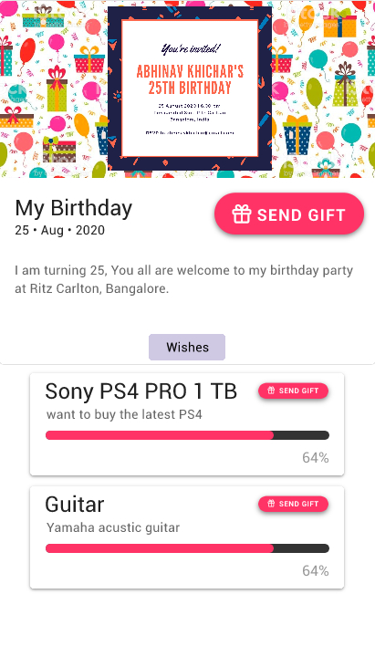
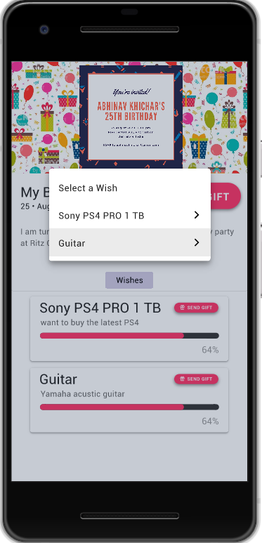
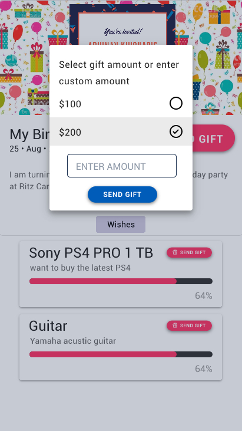
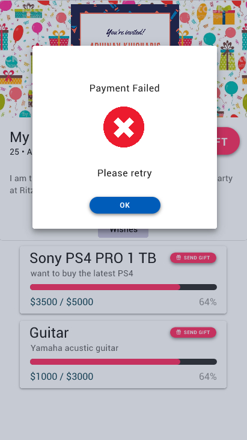
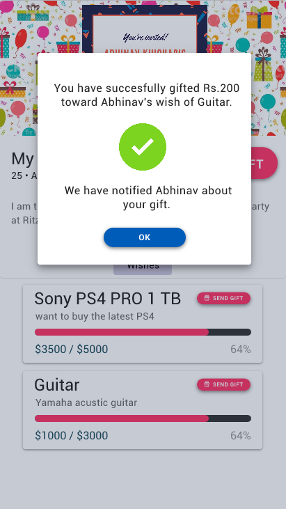

## Khwish-web
This is an Reactjs website app written in Javascript.
Please checkout a demo flow here, [khwish-web demo](https://2sjha.github.io/khwish-web).
This is the contributors' frontend for the Khwish platform, which does the following tasks:
- Display event details and all goals/wishes with their target amounts.
- Standard/Custom amount payment towards selected goals/wishes.
- Secure payment via Instamojo.
- Display thanks page after successful payment.

### Shared Event Link leads to this page

  

### Select Goal and Amount

  

### Payment Failure/Success

Please feel free to check out the codebase and let me know if you have any suggestions/improvements.

This was a part of the Khwish project, which I created in early 2020. Please read about it [here](https://gist.github.com/2sjha/b9012f396290bf3b8ebfc2b89fcd01c4). Khwish platform was discontinued around mid 2020; I'm no longer actively working on this project.
